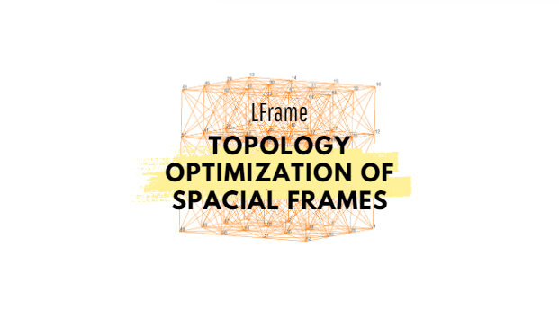

# LFrame - Topology Optimization of Spacial Frames 📐

This repository contains the codes developed for the undergraduate research project aimed at optimizing structures composed of 3D frame elements, without performance loss as material is removed.

## About Our Project :rocket:

Using the Finite Element Method, we implemented Topology Optimization techniques for elements with six degrees of freedom per node. Our goal is to minimize the structure's volume while imposing constraints on stress and displacement.

### Key Points :sparkles:

- Modeling of frame elements
- Objective function: currently, minimizing the total volume of the structure
- Use of the Augmented Lagrangian Method, through the Adjoint Problem approach
- Utilization of visualization tools for mesh generation and results
- Easy implementation of examples for validation

### How it works :sunglasses:

  - We define the problem in a '.yaml' file
  - We perform the initial analysis using FEM
  - The optimization and sensitivity analysis process begins
  - We check for convergence
  - If the process is completed, a '.pos' file for visualization, compatible with the open-source software Gmsh, is generated.

## How to use: :computer:
### Requirements:
- Julia Language
- The module 'Viga3D'
- Other dependencies can be found in 'colocar aq'

## Examples:
Colocar os exemplos aqui

 
