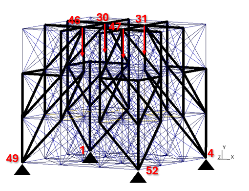
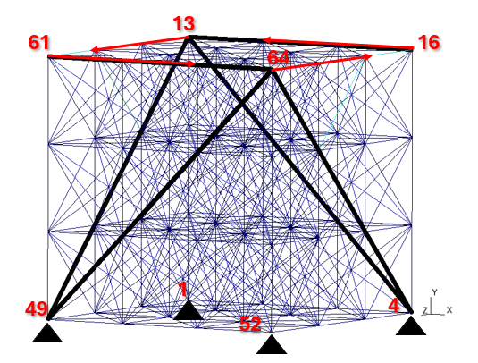

# LFrame - Topology Optimization of Spatial Frames 

<p align="center">

</p>

Welcome to our repository 🫶

This is my Undergraduate Research Project from the past one and a half years. Its goal is to perform a comprehensive analysis of structures discretized into frame elements, including equilibrium analysis and topology optimization.

During the course of my research, I was able to understand the logic behind both unconstrained and constrained optimization, as well as topology optimization. Moreover, it allowed me to gain significant knowledge in programming—not only with the Julia language used here, but also with the core logic of programming itself.

It was an honor to present part of the research showcased here at the XLV Ibero-Latin American Congress on Computational Methods in Engineering (CILAMCE 2024). You can check out my work, supervised by my research advisor, at the following link: https://publicacoes.softaliza.com.br/cilamce/article/view/10397.

I am truly happy to present all of my work here. For more detailed information about the theoretical development, please check the "Documentation File" located in the "Docs" folder. Enjoy! 😸


## About Our Project 💻

Using the Finite Element Method, we implemented Topology Optimization techniques for elements with six degrees of freedom per node. During the project, our initial goal was to minimize the compliance of the structure, subject to a volume constraint, using the SIMP approach. Yes, the classic problem. After validating the studied problems (both the mathematical approaches and the results obtained), our new objective became minimizing the structure's volume while imposing constraints on stress and displacement.
Currently, we're working on incorporating uncertainties in the applied loads — specifically, their magnitude and angle.

### Key Points 🔐

- Modeling of frame elements
- Objective function: currently, minimizing the total volume of the structure
- Use of the Augmented Lagrangian Method, through the Adjoint Problem approach
- Utilization of visualization tools for mesh generation and results
- Easy implementation of examples for validation

### How it works 

  - We define the problem in a `.yaml` file
  - We perform the initial analysis using FEM
  - The optimization and sensitivity analysis process begins
  - We check for convergence
  - If the process is completed, a `.pos` file for visualization, compatible with the open-source software Gmsh, is generated.

## How to use
### Requirements:
- Julia Language -- make sure it's up to date
- Gmsh -- required for visualizing the results

### Installation:
1. First, clone the repository, on Julia:
    ```bash
   git clone [https://github.com/CodeLenz/LFrame]
2. Navigate to the repository directory:
   ```bash
   cd("...\\LFrame")
3. Install the required Julia packages
   ```bash
   ]instantiate()
   ```

### Running an Example:
To run an exemple, simply use
```bash
  include("examples/example123.yaml")
```

This will perform an initial FEM analysis and start the optimization process. After the procedure is complete, a `.pos` file is generated for visualization in Gmsh. To view the results,
1. Open Gmsh
2. In the File menu, click Open
3. Navigate to the folder of the examples, the file will be generated there
4. Select the file

## Mathematical Formulation ⚙️

We started with the classic minimization of the structure's compliance with volume constraint, using the Optimum Criteria approach, and then, to optimize the optimization (🙃), we used the Augmented Lagrangian method.

With the sensitivity analysis being done with the derivatives of the Objective Function and the Augmented Lagrangian Function, the process is stopped when the Karush-Kuhn-Tucker conditions are achieved. The validation of the codes was done in parts. The derivatives were compared to results using the Finite Differences method. The numerical results of the static analysis (i.e., the displacement vector found using the equilibrium equation) were compared to benchmark problems.
Two examples are shown in the next section.

Therefore, we were encouraged to continue with the research by adding new objectives and constraints. The new objective function is the volume of the structure, and displacements became the constraints. Therefore, we were ready to include the most problematic constraint, the local stress. An adjustment was made to the Augmented Lagrangian function to include the adjoint problem, improving the computational time of the process, a necessary step due to the larger number of constraints.

The current optimization problem is the minimization of the volume with local stress constraints, and I am looking forward to adding uncertainties to the applied loads. This addition will make the problem more complex but also much more interesting.

Since the equations developed are somewhat intricate, I will spare GitHub from interpreting them. You can check the main mathematical developments in the "Documentation File" located in the "Docs" folder.


## Examples: 🛠️

### Example 1: Simply supported structure under vertical load. 
The first example consists of a  simply support structure subjected to four point loads of $100$N in the negative vertical direction ($y$) at nodes $30$, $31$, $46$, and $47$. The Dirichlet boundary conditions are null displacements in the $x$, $y$, and $z$ directions at nodes $1$, $4$, $49$, and $52$ (bottom corner nodes). The minimum volume condition is $40\%$ of the original volume. The  initial penalization value, $c^0$, is set to $1.0$. The visualization of the problem and the final result can be seen in Fig. 1. Full elements are shown in black and removed elements in blue. Initial compliance is $0.0060648$Nm and final compliance is $0.00089169$Nm.


<p align="center">
  Image 1: Result of the first example

</p>

<p align="center">

</p>

### Example 2: Simply supported structure subjected to torsion.
The second example consists of a structure under point forces simulating torsion at the top of the structure. The applied load consist of two forces of $1500 N$ in the $x$ direction on nodes $16$ and $61$ and two forces of $2000 N$ in the $z$ direction on nodes $13$ and $64$. The essential boundary conditions were the same of the Example 1. The minimum volume constraint is $20\%$ of the original volume. The initial penalization value, $c^0$, is set to $10.0$ .
The visualization of the problem and the final result can be seen in Fig. 2. 
Initial compliance is $0.22646$ Nm and final compliance is $0.01940$ Nm.  
Full elements are shown in black and removed elements in blue.

<p align="center">
  Image 2: Result of the second example
</p>

<p align="center">

</p>


<p align="center">

</p>
 
